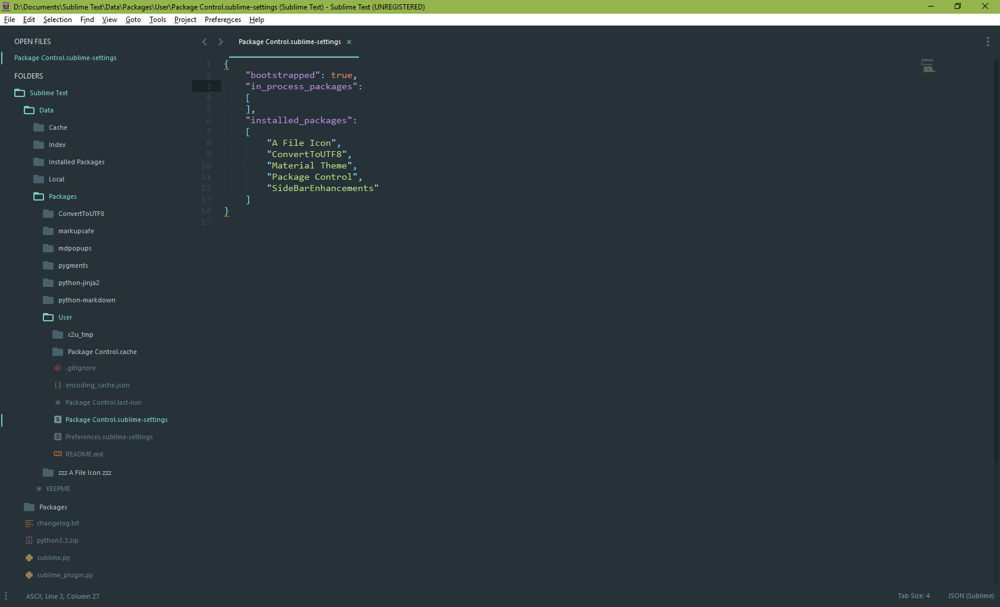

# Sublime Text Settings


## Initial
1. Install [Sublime Text 3](https://www.sublimetext.com/3)
2. Install [Package Control](https://packagecontrol.io/installation)
3. Close Sublime Text and delete all files in **User** folder
    - Windows: `~\AppData\Roaming\Sublime Text 3\Packages\User`
    - Windows Portable: `INSTALLED-FOLDER\Data\Packages\User`
    - Ubuntu: `~/.config/sublime-text-3/Packages/User`
4. Clone settings into **User** folder
    ```bash
    git clone git@github.com:lynn9388/sublime-text-settings.git .
    ```
    Change file permissions in Ubuntu
    ```bash
	sudo chmod 777 Package Control.sublime-settings Preferences.sublime-settings
    ```
5. Run Sublime Text and wait for packages to install
6. Activate **Material Theme**

    Right click in text area -> Material Theme -> Activate -> Material Theme

## Update
Execute commands in **User** folder

```bash
git fetch
git reset --hard origin/master
```
